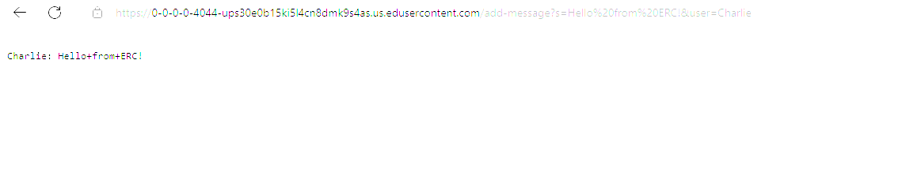
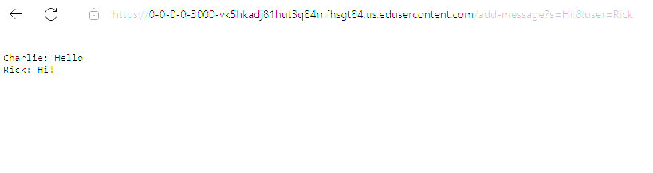
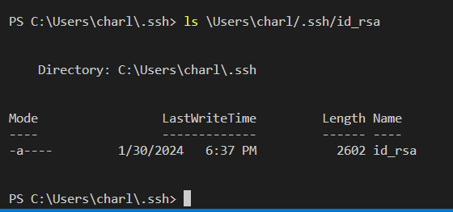
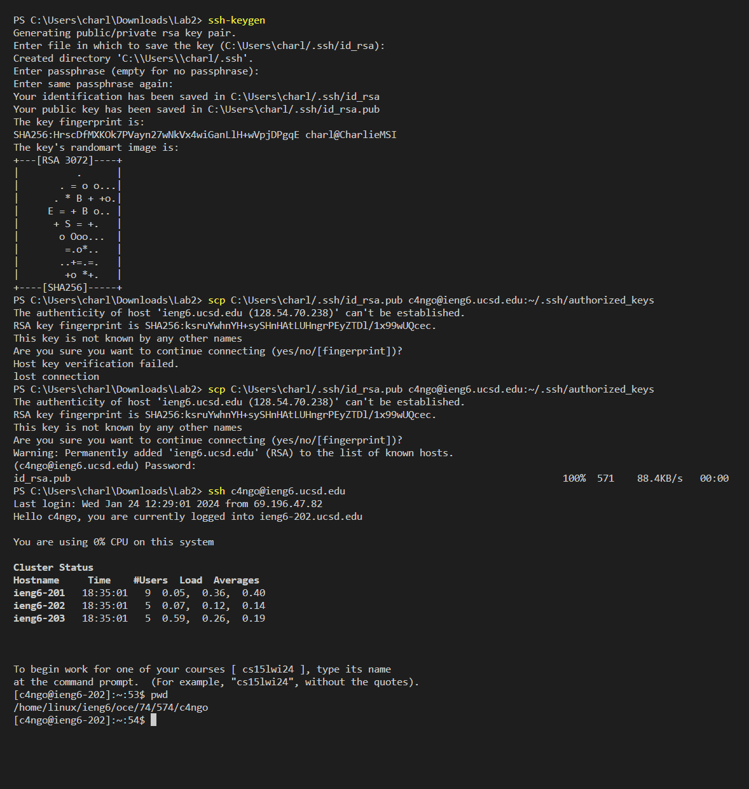

## LAB 2 REPORT BY CHARLIE NGO

1/30/24

### Servers and SSH Keys (Week 3)
---

## Part 1

Write a web server called ChatServer that supports the path and behavior described below. It should keep track of a single string that gets added to by incoming requests. 

This is my code for ChatServer. 

    
    import java.io.IOException;
    import java.net.URI;
    class Handler implements URLHandler {
    String sentence = "";
    public String handleRequest(URI url) {
        if (url.getPath().equals("/add-message")) {
            String[] parameters = url.getQuery().split("&user=");
            String statement = parameters[0];
            String user = parameters[1];
            statement = statement.substring(2);
            if (sentence != null){
            sentence = sentence + "\n" + user + ": " + statement;
            return String.format("%s", sentence);
            }
            sentence = user + ": " + statement;
            return sentence;
        } else {
            return "404 Not Found!";
            } 
        }   
    }

    class ChatServer {
    public static void main(String[] args) throws IOException {
        if(args.length == 0){
            System.out.print("Missing port number! Try any number between 1024 to 49151");
            return;
        }

        int port = Integer.parseInt(args[0]);

        Server.start(port, new Handler());
    }
    }
    

---

##### Screenshot 1 (I apologize for the bright photo)

#### Which methods in your code are called?

* When I run my program, the first method that is called is the `start` method in the `Server` class. The second method that is called is the `handleRequest` method in the `Handler` class. Some other methods that are used are `getPath`, `getQuery`, and `substring`. 

#### What are the relevant arguments to those methods, and the values of any relevant fields of the class?

* The `start` method needs two arguments, `port` and a `Handler` reference object. 
* This method starts the web server with a port number of my choosing. I can find the url of this web server, in which I used Edstem's. 
* The port is an integer that is taken and used in the `Server` class. However, I can't explain exactly how this works as it is not required in this course. 
* The `Handler` object has a method called `handleRequest`. This method varies as it is an interface method. In my case, I made `handleRequest` print a user and string. 
* `handleRequest` first creates an empty string called `sentence` then it takes in a url as an argument. 
* This program then checks if the path of the url is equal to `/add-message`. 
* If this is the case, the program used the `getQuery` method and splits the `&`. 
* This would leave a String array to look like this hypothetically: `{s=<string>, user=<string>}` 
* Our target goal is to only display the words that are in `<string>` 
* After this, we create two String reference objects called  `statement` and `user`.
* Then we take a substring of both objects to only keep `<string>`.
* Now we use an `if statement` to check if this is not the first instance of this method being called.
* Finally, it returns a string in the correct format: `<string: <string>`.

#### How do the values of any relevant fields of the class change from this specific request? If no values got changed, explain why.

* The values of whatever is replaced in `<string>` in the query ultimately affect and change `sentence` object. Depending on what `<string>` looks like in the url, the program will display on the web server the iterated values. For example if my request looks like this in the query `s=Hello From ERC!&user=Charlie`. Then the `sentence` field will produce the result `Charlie: Hello+From+ERC!`. This is because the values from the `<string>` in the query are `Hello From ERC` and `Charlie`. These are stored in `statement` and `user`. Then `sentence` takes in `statement` and `user` to create a formatted String structure. 

#### Screenshot 2

In this case, most of the things are the same. 

#### Which methods in your code are called?

* When I run my program, the first method that is called is the `handleRequest` from the `Handler` class. Some methods that are nested in `handleRequest` are the `getPath()`, `getQuery` , and `format`.  We do not call the `Server.start()` method because we already called it previously.

#### What are the relevant arguments to those methods, and the values of any relevant fields of the class?

* The relevant arguments to these methods would be `3000` for `port` in the `start` method. This creates a webserver with the port 3000.
* The `new Handler()` argument is initiated and only able to be accessed while you are in the web server.
* In the `handleRequest` method, the argument is a url is what gets read in the program. Some methods used are `getPath` and `getQuery`. 
* My url is be the following `/add-message?s=Hello&user=Charlie`
* the String `sentence` right now is currently empty. (Usually for the first time we run this program)
* `user` and `statement` are the same.
* We fail the `if` statement check because our `sentence` is currently `null`. So we create a sentence on the webserver saying `Charlie: Hello`.

#### How do the values of any relevant fields of the class change from this specific request? If no values got changed, explain why.

* In  this case I will run the program again but this time changing the url to  `/add-message?s=Hi!&user=Rick` 
* What changes is when I run the program, `sentence` is no longer null as it is now updated to: `Charlie: Hello`. 
* So what changes is that I will pass the `if` statement argument.
* the `if` statement updates sentence by adding the current string with a `\n` and then a new string.
* Now the webserver should look like this:

        
        Charlie: Hello
        Rick: Hi!    

## Part 2
Using the command line, show with ls and take screenshots of:

* The absolute path to the private key for your SSH key for logging into ieng6 (on your computer, an EdStem workspace, or on the home directory of the lab computer)
  

* The absolute path to the public key for your SSH key for logging into ieng6 (this is the one you copied to your account on ieng6, so it should be a path on ieng6's file system)

* A terminal interaction where you log into your ieng6 account without being asked for a password.

## Part 3

**In a couple of sentences, describe something you learned from lab in week 2 or 3 that you didn't know before.**

What I learn in week 3 was the definition of symptoms, bugs, and failure-inducing input. I learned that **symptom** is the behavior you see. **Bugs** are the flaw in the program that causes symptoms. **Failure-inducing input** are inputs that demonstrate bug symptoms. I believe now that what we can a bug in a video game is actually the symptom. The bug in the videogame is what happens in the background. 