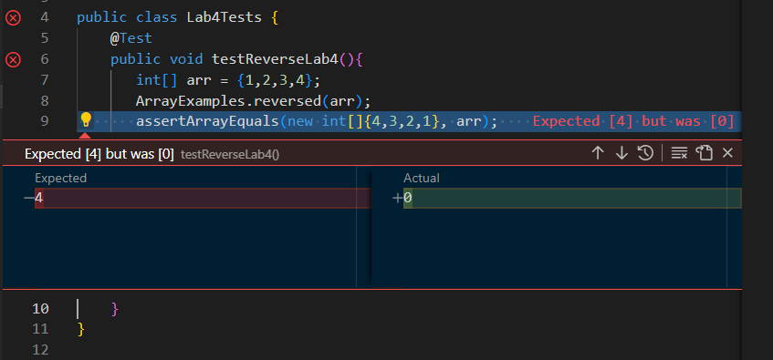
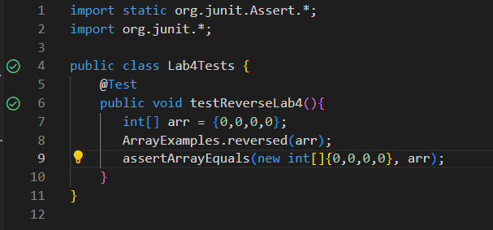

# Lab Report 3  
**By Charlie Ngo**

## Part 1 Bugs 

I am going to choose the program called `ArrayExamples.java`. This is the original code provided in Lab 4. 

    static int[] reversed(int[] arr) {
    int[] newArray = new int[arr.length];
    for(int i = 0; i < arr.length; i += 1) {
      arr[i] = newArray[arr.length - i - 1];
    }
    return arr;
    }

For my failure-inducing input, this is my JUnit test. 

    @Test
    public void testReverseLab4(){
       int[] arr = {1,2,3,4};
       ArrayExamples.reversed(arr);
       assertArrayEquals(new int[]{4,3,2,1}, arr);
    }

My failure-inducing input is my `int[] arr = {1,2,3,4}` because the program does not handle the input properly based on how it was written. 

Here is an input that doesn't cause a failure.

    @Test
        public void testReverseLab4(){
        int[] arr = {0,0,0,0};
        ArrayExamples.reversed(arr);
        assertArrayEquals(new int[]{0,0,0,0}, arr);
        }

The reason that input does not cause a bug is because based on how the code was written, the returned array will always produce `0`. This is because `arr` is getting assigned `newArray` values. However `newArray` was created as a new array with the length of `arr`. This causes all values to start off as `0`. So having a test where the arr is all zeros will produce the correct outcome.

For `symptoms`, I will provide screenshots of both outcomes for the above inputs. 

Here is the test symptom when the input is `int[] arr = {1,2,3,4}` 

Here is a test symptom when the input is `int[] arr = {0,0,0,0}` 

This is `ArrayExamples.java` bugged code

    static int[] reversed(int[] arr) {
    int[] newArray = new int[arr.length];
    for(int i = 0; i < arr.length; i += 1) {
      arr[i] = newArray[arr.length - i - 1];
    }
    return arr;
    }

Here is my fix for the bug

    static int[] reversed(int[] arr) {
    int[] newArray = new int[arr.length];
    for(int i = 0; i < arr.length; i += 1) {
      newArray[i] = arr[arr.length - i - 1];
    }
    return newArray;
    }

What I did was simply change the code inside the for loop. I simply flipped the fields. I also made the method return `newArray` instead of `arr`.

## Part 2 - Researching Commands `GREP`

## `-c`

What `-c` does is count the lines that match the pattern. 

Here is an example of using `-c`.

        grep -c ".txt" find-results.txt

This was the output 

        1391

What this code is doing is finding in all the lines that contain this pattern of `.txt` in the file `find-results.txt` and returning the number of line that contain this pattern. `find-results.txt` has `1391` lines that contain `.txt`. 

Here is another example of using `-c` 

        grep -c "911report" find-results.txt

This was the output

        18

I find this command useful if I want to find the amount of lines a pattern is seen in a file. 

## `-i` 

What `-i` does is enables search for a string case insensitively in a given file

Here is an example of using `-i` 

    grep -i ".txt" find-results.txt

The output was displaying all the files containing `".txt"` There are 1391 lines, so I will not show the entirety in code block. Here is an example of how it looks. 

    technical/
    technical//government
    technical//government/About_LSC
    .
    .
    .
    technical//911report/chapter-11.txt

Here is another example of using `-i`

    grep -i ".TXT" find-results.txt

The output was the same as the previous example 

    technical/
    technical//government
    technical//government/About_LSC
    .
    .
    .
    technical//911report/chapter-11.txt

How I find this command useful because it ignores any case sensitivity in a file. I can imagine using this to search for a specific word in a file regardless of how it is presented as. 

## `-l`

What `-l` does is display only the list of filenames. 

Here is an example of me using the command

    grep -l ".txt" *

Here is the output 

    TestDocSearch.java
    biomed
    biomed-sizes.txt
    count-txts.sh
    find-results.txt
    grep-results.txt
    grep: lib: Is a directory
    plos-sizes.txt
    grep: technical: Is a directory
    word-count.sh

Essentially in the `docsearch` directory, these are all the files and directories that contain `.txt`. Notice how some results produce `Is a directory`. So there are files inside those directories that contain `.txt`. 

Here is another example of the command 

    grep -1 "911report" *

Here is the output 

    biomed
    grep: lib: Is a directory
    grep: technical: Is a directory

I find this command useful if I just want to know the files or directories that contain the text pattern. If I wanted to search for `911report`, it narrows the `docsearch` directory down to 3 files. 

## `-v`

`-v` prints out all the lines that do not match the pattern. 

Here is an example of using `-v` 

    grep -v ".txt" find-results.txt

The output yields

    technical/
    technical//government
    technical//government/About_LSC
    technical//government/Env_Prot_Agen
    technical//government/Alcohol_Problems
    technical//government/Post_Rate_Comm
    technical//government/Media
    technical//plos
    technical//biomed
    technical//911report

What this output did was display all the non `.txt` files in `docsearch`. 

Here is another example of using `-v` 

    grep -v "biomed" biomed-size.txt

The output is nothing because all lines in `biomed-size.txt` contain the pattern `biomed`. Because of this, the output on the terminal is nothing. I find this command useful because I can remove lines in a file that contain a certain phrase. In this case, I used it to narrow it down to all files that are not biomed related. 

This was the source I used
`https://www.geeksforgeeks.org/grep-command-in-unixlinux/`