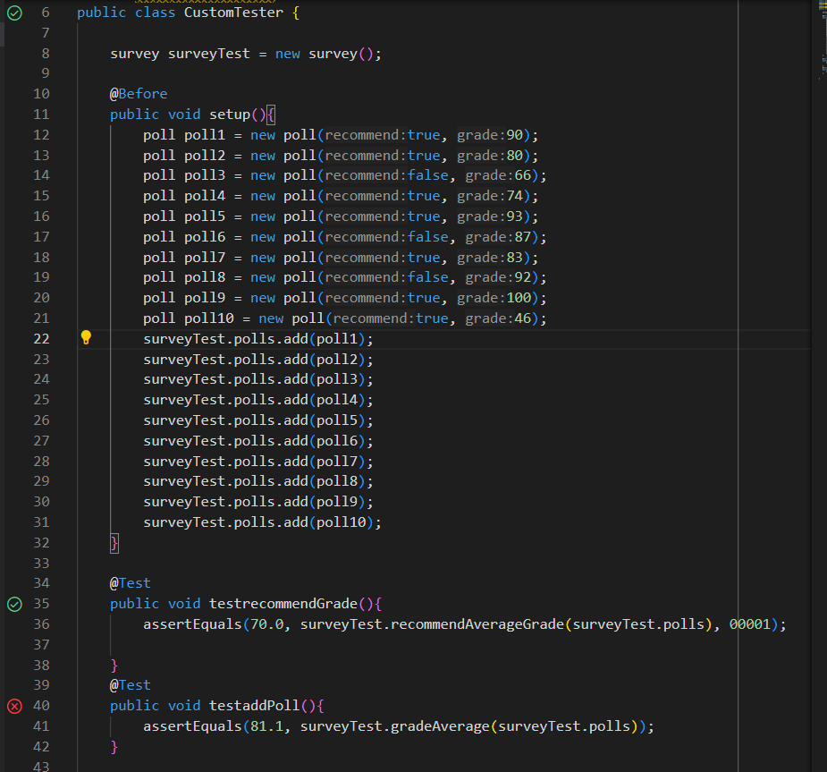
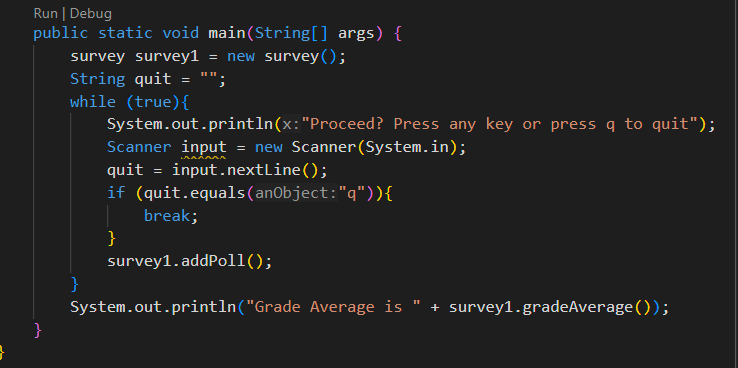

# LAB 5 REPORT
by Charlie Ngo

March 12 2024

## Part 1 - Debugging Scenario

### Edstem Discussion

<ins> **James McFlurry Februrary 24 10:30 PST** <ins>

**`Method gradeAverage`** not working correctly.

My `gradeAverage` is not working properly. I put the correct grading scale in `if` statements but some reason the return value is always goes to `D-`. 

<ins> **TA John Wick Februrary 25 7:00 PST** <ins>

Hello James, I would need more information about your `gradeAverage` method. I need you to send me a screenshot of your code. Otherwise, try creating a main method that continually takes in polls using the `addPoll` method with a while loop. I would recommend creating a bash script to run it faster.  Proceed to test out your `addPoll` method by messing around with the scanner inputs. Then give me your directory structure so I can check if you are missing any key files. 

<ins> **James McFlurry Februrary 25 7:34 PST** 

Here was my file structure 

CAPES (folder)
- lib (folder)
- - hamcrest-core-1.3.jar (jar file)
- - junit-4.13.2.jar (jar file)
- CustomTester.java (java file)
- poll.class (class file)
- survey.class (class file)
- survery.java (java file)
- test.sh (shell file)
  
Here is my gradeAverage code

        public String gradeAverage(){
        double sum = 0.0;
        for (int i = 0; i < polls.size(); i++){
            sum += polls.get(i).grade;
        }
        String letterGrade = "";
        sum = sum / polls.size();
        if (sum >= 97){
            letterGrade = "A+";
        }
        else if (sum >= 93){
            letterGrade = "A";
        }
        else if (sum >= 90){
            letterGrade = "A-";
        }
        else if (sum >= 87){
            letterGrade = "B+";
        }
        else if (sum >= 83){
            letterGrade = "B";
        }
        else if (sum >= 80){
            letterGrade = "B-";
        }
        else if (sum >= 77){
            letterGrade = "C+";
        }
        else if (sum >= 73){
            letterGrade = "C";
        }
        else if (sum >= 70){
            letterGrade = "C-";
        }
        else if (sum >= 67){
            letterGrade = "D+";
        }
        else if (sum >= 65){
            letterGrade = "D";
        }
        else if (sum >= 60){
            letterGrade = "D-";
        } else {
            letterGrade = "F";
        }
        return letterGrade;
    }

I tried doing what you told me to do.
Here is my main method.

Here were my terminal outputs. 

My bash script simply compiles the code. I inputted the grades of each poll to be `90, 80, 65, 75`. I calculated the average and it should be `77.5`. I went back into my `gradeAverage` method code and I found out that my consecutive `if` statements were incorrect. I should have them to be `else if` instead. Thank you John Wick for the help.

## Part 2 - Reflection

What I learned in lab in the second half of this quarter was how to use `JDK` and `bash`. I found `bash` interesting but confusing because of the syntax. `JDK` is more straightforward. Another thing I learned was `vim` which is useful when editing code on a server. 