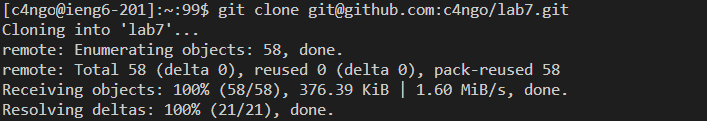
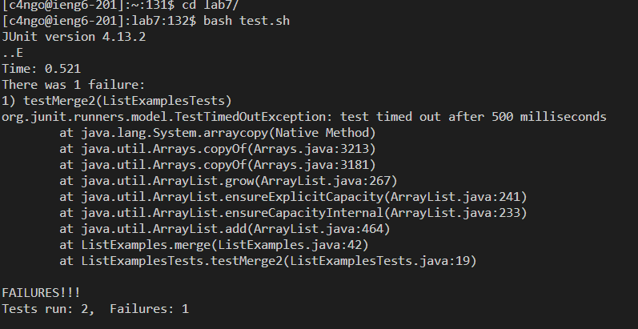
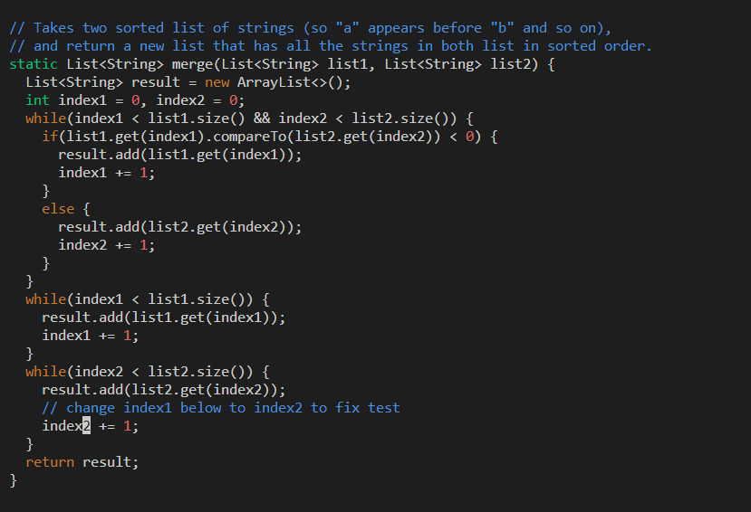
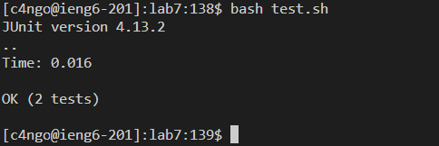
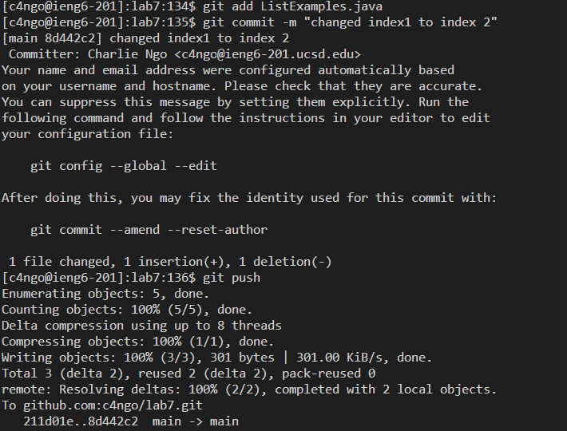

# Lab Report #4
### by Charlie Ngo

My time for this speed trial was a total of 1:35 minutes. 

**For step 4 **

The keys for logging in to ieng6 was the following:

`s s h c 4 <tab> , <enter>` 

For some reason, my password was required even though I created a key for it before. For security reasons, I will not include the input for that.
The command shortcut `<tab>` autocompleted my ieng6 email.

What this command did was log me on the ieng6 server.

**For step 5:**

The keys for this step was the following:

`g i t c l o n e , <ctrl c> on the ssh url , <right mouse click> , <enter>` 

The reason I pressed `<right mouse click>` command is because somehow `<ctrl v>` does not paste and `<right mouse click>` pastes on the terminal.

What this command did was copy my fork of lab7 through cloning the ssh url.

**Step 6:**

For this step, the following keys I pressed were:

`cd l <tab> , bash <tab>, <enter>`

These keys were all I needed to run the bash script. The command `<tab>` autocompleted `lab7` and `test.sh`.

The command ran the bash script.

**Step 7**

The keys to fix the bug were the following:

`/v i m L i <tab> j a v a / i n d e x 1 , <down> <down> <down> <down> <down> <down> <down>, <i> ,<backspace> , 2 <esc> , : w q <enter>`

The command `vim ListExamples.java` goes into the vim text editior mode. `/index1` in vim essentially goes to every `index1` instance in the code. I had to press `<down>` 7 times in order to get to the `index1` I wanted to change. `<i>` was to go into insert mode. I then deleted the 1 and replaced it with 2. Then I pressed `<esc>` to exit insert mode. Lastly I pressed `:wq` to save and exit vim.

The command edited the `ListExamples.java` file to fix the bug. 

**Step 8** 

The key I pressed were the following:

`<up> <up> <up> <up> , <enter>`

I only needed to go back to my terminal history and find `bash tesh.sh` to rerun the test.

The command ran the bash tesh.sh

**Step 9**

The following keys I pressed were:

`g i t a d d L i <tab> <enter>, g i t c o m m i t - m " c h a n g e d i n d e x t o i n d e x 2 " <enter>, g i t p u s h <enter>`

Most of my key pressed were simply typing out the commits manually. 

What these commands did were saving my edits of the file `ListExamples.java`. Commit shows the changes I did in and titles it. Push sends the editting file back to Github.

